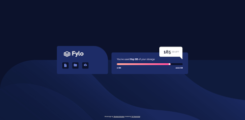
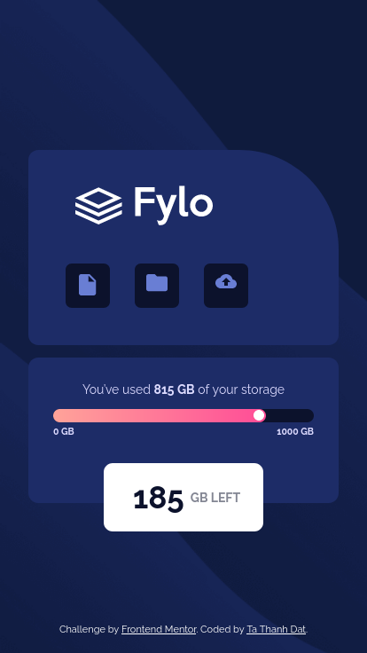

# Frontend Mentor - Fylo data storage component solution

This is a solution to the [Fylo data storage component challenge on Frontend Mentor](https://www.frontendmentor.io/challenges/fylo-data-storage-component-1dZPRbV5n). Frontend Mentor challenges help you improve your coding skills by building realistic projects.

### The challenge

Users should be able to:

-   View the optimal layout for the site depending on their device's screen size

### Screenshot

-   Desktop Version



-   Mobile Version



### Links

-   [Live site URL here](https://your-live-site-url.com)

## My process

### Built with

-   Semantic HTML5 markup
-   CSS custom properties
-   Flexbox
-   CSS Grid
-   Mobile-first workflow

### What I learned

-   How to style triangle with CSS

```css
.storage-left:after {
    content: '';
    position: absolute;
    bottom: 0;
    right: 0;
    width: 0;
    height: 0;
    border: 38px solid transparent;
    border-top-color: white;
    border-bottom: 0;
    border-right: 0;
    margin-bottom: -20px;
}
```

## Author

-   Facebook - [Ta Thanh Dat](https://www.facebook.com/tathanh.dat.5/)
-   Frontend Mentor - [@Ta Thanh Dat](https://www.frontendmentor.io/profile/tathanhdat)
